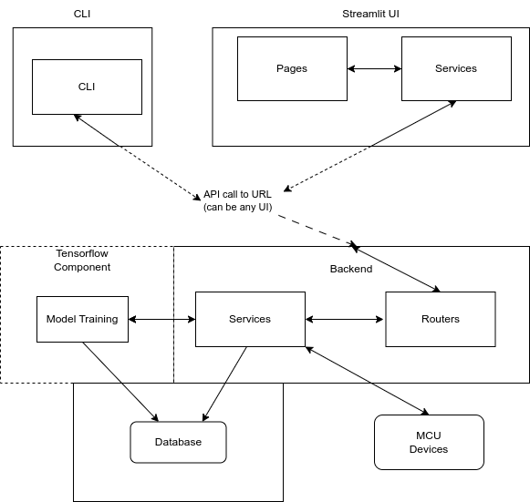

# Architecture Guide
This page contains general information about the architechture and how each component is related to each other.

## overview

TinyMLaaS consist of several components:
 - backend
 - streamlit frontend
 - cli
 - MCU components

The different components are stored in their own repositories which can be found [here](https://github.com/orgs/TinyMLaas/repositories).

The backend is the core component which contains all the API endpoints. By calling them you can execute all the tasks necessary for the workflow. The backend is responsible with communicating with the machine learing components, storing data in the database and installing & managing MCU devices.

Tensorflow machine learning components live in the main repository and need to be fetched for the backend seperately.

MCU repository contains the bridge for communicating with the devices and the code needed for devices.

We have implemented two different interfaces for the TinyMLaaS: CLI and website GUI using streamlit. Since you can make API calls directly to backend it's extremely simple to build your own frontends in the future.

 
## Block Diagram

The backend is the main component that deals with calling the tensorflow functions and communicating with the MCU devices. Tensorflow is currently the supported UI but you can also make API calls directly or use the CLI. In the future the tensorflow components can be containarized as their own service.

## Key Components
- ML model training
- Data Storage and loading (database)
- ML model quantization and optimization
- ML model compilation for MCUs

